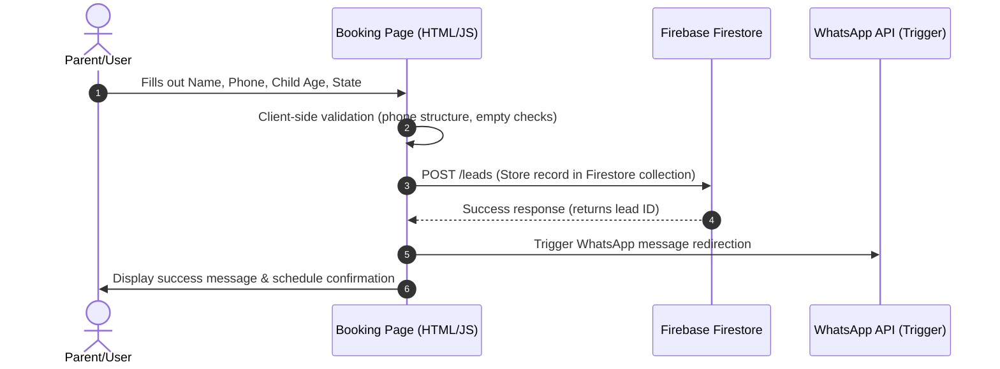

# SkillNest API & Integration Documentation

## 1. Firebase Hosting Redirect Map
Our website redirects and static routing configurations are managed in `firebase.json` at the project root. This ensures that legacy paths are resolved and search crawlers follow clean URL structures.

## 2. Lead Form & Demo Booking Flow
The primary lead capture point on the website is the Free Demo Booking page (`/contact/book-demo.html`).

### Lead Schema (Firestore `leads` Collection)
Each lead submission writes a document with the following schema:
- `leadId` [String, Auto-generated]
- `parentName` [String]
- `contactPhone` [String, 10-digit Indian mobile number validation]
- `childAge` [Number, typical range 8-16]
- `grade` [String, Class 3-10]
- `stateLocation` [String]
- `submittedAt` [Timestamp]
- `status` [String, e.g. "new", "scheduled", "completed"]

## 3. WhatsApp Redirect API
When a parent confirms their booking, the website redirect triggers a WhatsApp API path:
- **Base URL:** `https://wa.me/918827731006`
- **Pre-filled Message parameter:**
  `text=Hello%20SkillNest%2C%20I%20have%20booked%20a%20free%20demo%20for%20my%20child%20named%20%5BName%5D.`
- **Result:** Launches parent's WhatsApp app with a direct thread to founder Aanandita Uplopwar.
